# Labyrinth

Unleash the power of your mind and navigate your way out of the labyrinth.

**Labyrinth** demonstrates the *Unicorn Unity Bandpower Interface* developed by g.tec medical engineering. The application shows how brain signals can be used to interact with digital environments in real time.

The application works exclusively with the following devices:

* [Unicorn BCI Core-8](https://www.gtec.at/product/unicorn-bci-core-8-eeg-device-for-high-quality/)
* [Unicorn BCI Core-4 Headband](https://www.gtec.at/product/unicorn-bci-core-4-headband/)

The Labyrinth game is a **Unity-based Windows application**.

You can download the latest version from the **GitHub Releases page**:

➡️ **[Download Labyrinth (GitHub Releases)](https://github.com/unicorn-bi/Unicorn-BCI-Core-Labyrinth-Game/releases/latest)**

This will download a **ZIP archive** containing the executable and all required files.

---

# Table of Contents

* [Requirements](#requirements)
* [Startup the Labyrinth Game](#startup-the-labyrinth-game)
* [Amplifier Selection and Signal Quality](#amplifier-selection-and-signal-quality)
* [Gameplay](#gameplay)

---

# Requirements

To run the Labyrinth game you will need:

* **Unicorn BCI Core-8** or **Unicorn BCI Core-4 Headband**
* **Windows 10 or newer**
* **Bluetooth 5.0 or newer**

---

# Startup the Labyrinth Game

After downloading the ZIP archive:

1. Extract the archive to a folder of your choice.
2. Launch **`Labyrinth.exe`** from the extracted folder.

Depending on your Windows version and Windows Defender settings, Windows may show a security warning before launching the application.

If this happens:

1. Click **"More info"**
2. Select **"Run anyway"**

Before or after launching the game, **turn on and wear your Unicorn BCI Core device**.

If the device is active, a **rune (stone)** in the game will light up and display the **serial number of your amplifier** (for example `U4-2025.02.03`), as shown below.

The other two runes are **simulators**, which do not have access to your brain signals.

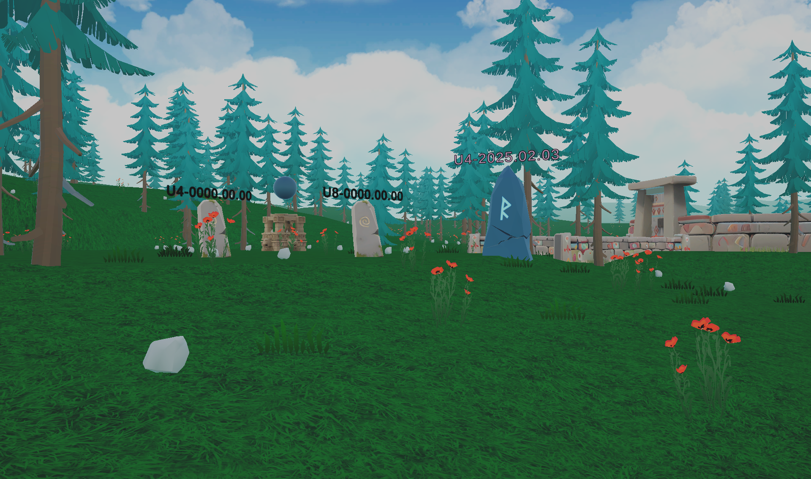

---

# Amplifier Selection and Signal Quality

You can move around the environment using:

* **W, A, S, D** or **Arrow keys** – move
* **Mouse** – look around
* **Space bar** – jump

To select your amplifier, **walk through the rune displaying your device’s serial number**.

After selecting your amplifier, the display will change:

* From **one sphere** (no amplifier connected)
* To **4 or 8 spheres**, depending on the number of EEG channels of your Unicorn device.

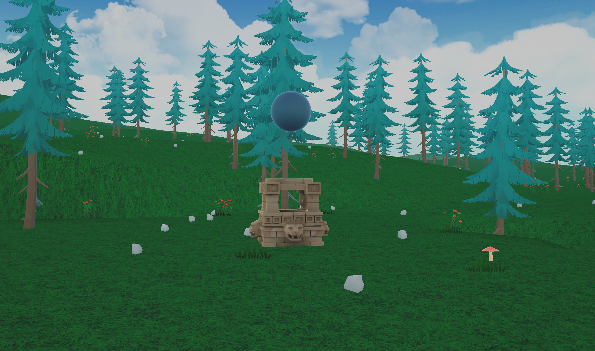

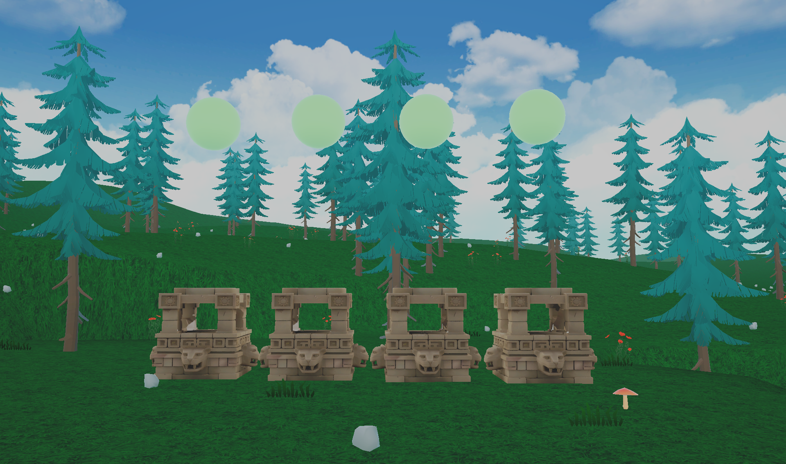

## Signal Quality

The **color and height of the spheres** indicate signal quality:

* 🟢 **Green spheres** – excellent signal quality
* 🟠 **Orange spheres** – insufficient signal quality

In the example below (using the Unicorn BCI Core-8), the first three channels have insufficient signal quality.

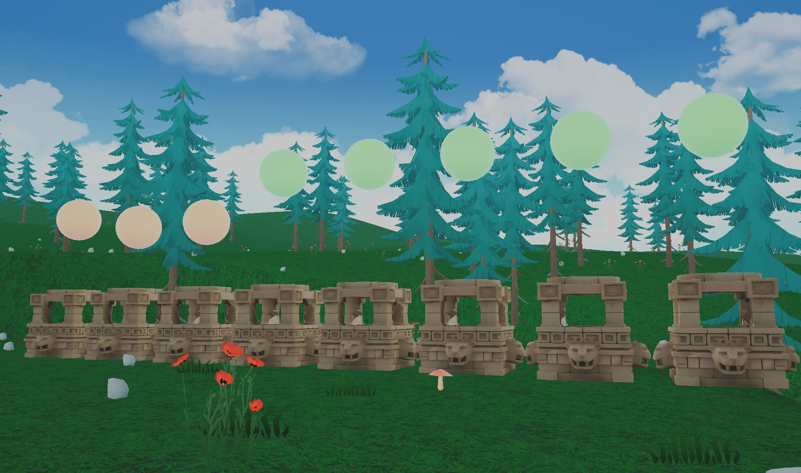

You can improve signal quality by:

* Ensuring the **Unicorn Hybrid electrodes have good contact with your scalp**
* **Gently rubbing the electrodes in a circular motion** against the scalp

Once the signal quality is sufficient, the spheres will turn green.

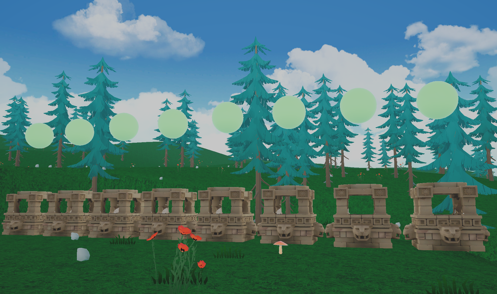

You are now ready to begin the game.

---

# Gameplay

Since the game utilizes **your brain activity**, it first needs to **calibrate a model of your individual brain rhythms**.

Calibration is performed using two distinct conditions.

---

## Eyes Open Condition

First, enter the entryway shown below and **stand still**.

A voice will instruct you to **remain still with your eyes open**.

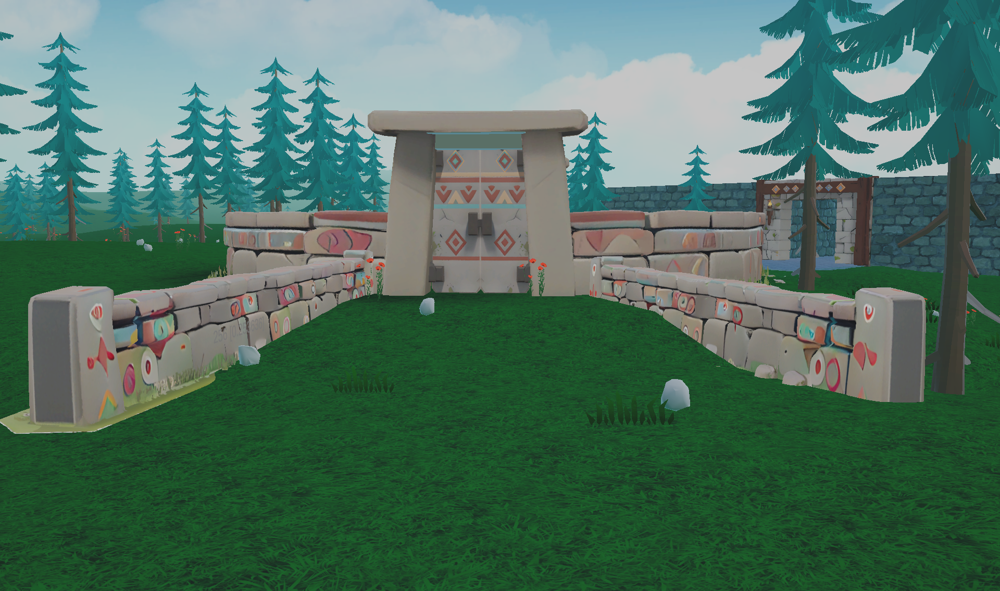

---

## Eyes Closed Condition

Next, the voice will instruct you to **enter the Circle of Stillness** by walking through the gate once it opens.

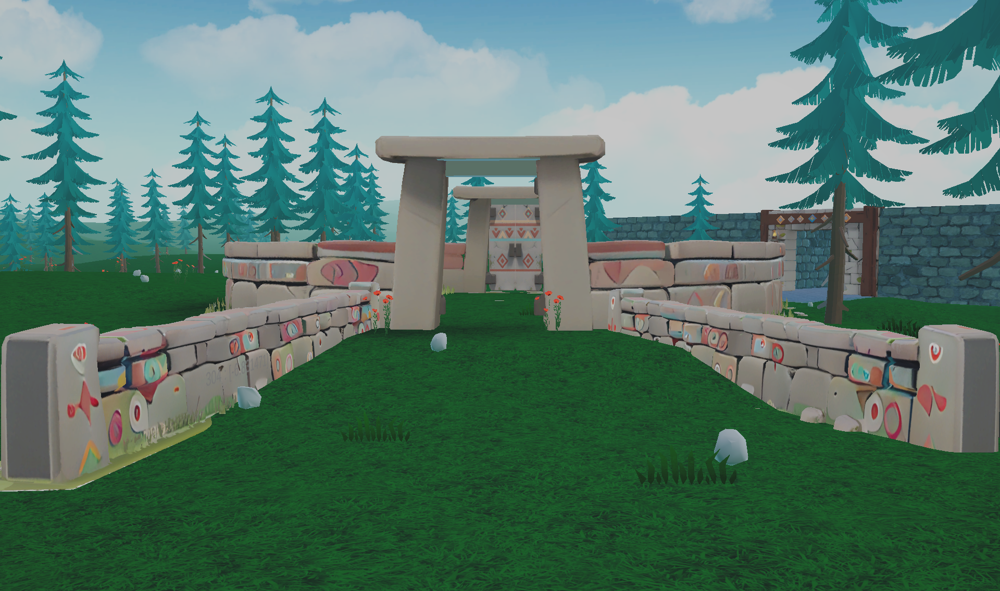

Once inside the circle:

* **Close your eyes**
* **Relax**
* Focus on your breathing if you wish

Keep your eyes closed until the voice instructs you to open them again.

Finally, the gate will open so you can **leave the Circle of Stillness**.

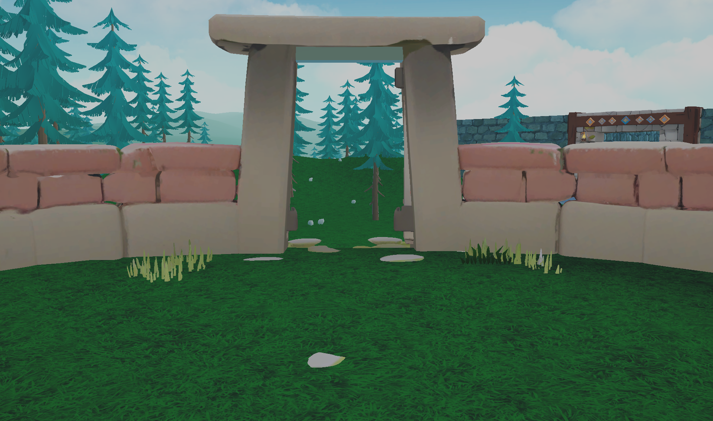

---

## Entering the Labyrinth

Make your way to the labyrinth using **W, A, S, D**.
You can also **jump using the space bar**.

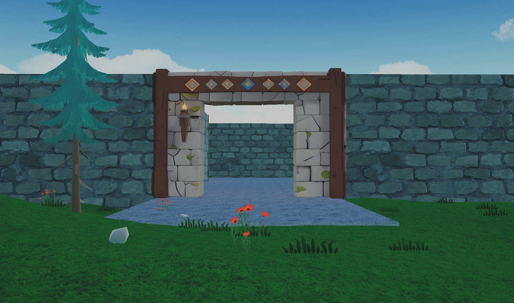

---

## Using Your Brain Powers

Inside the labyrinth you will encounter several **intersections**.

At each intersection your brain activity can reveal which direction is correct.

When you:

* **Close your eyes**
* **Relax**

the screen will **fade to dark**, and a **voice will guide you toward the correct path**.

Make sure your **audio is enabled**, as the voice provides important guidance.

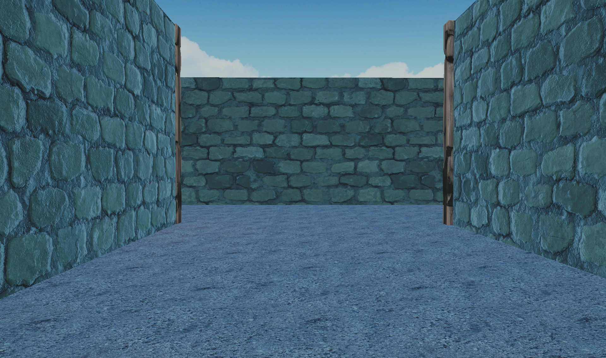

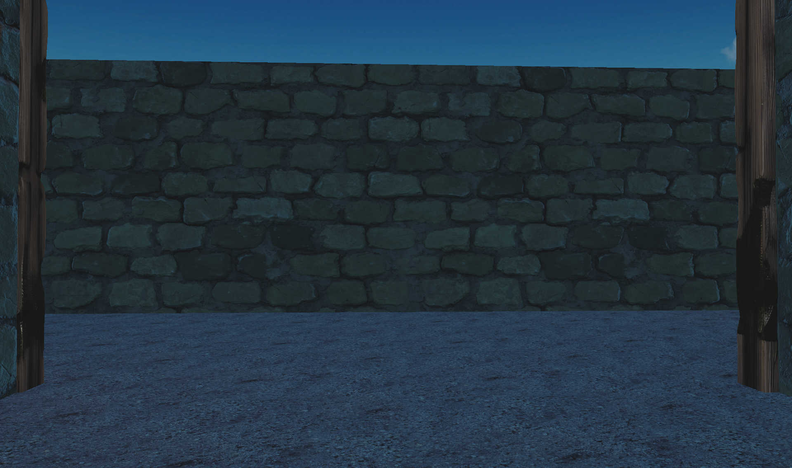

---

## Escaping the Labyrinth

To finally escape the labyrinth, you must **trust your instincts**.

At the final moment, the voice will instruct you to **walk through a wall**.

Follow the instruction to discover the way out.
